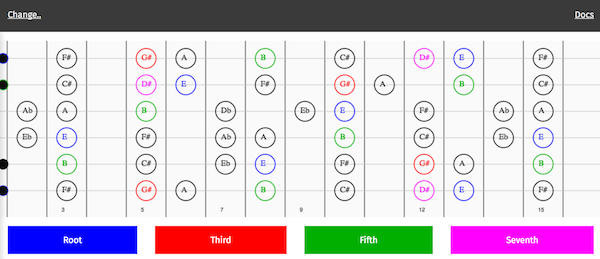

# Fretboard

Fretboard Canvas Display Engine for tonal & tonal-fretboard



## Usage

```javascript
let fretboard = new Fretboard({
  tuning: 'guitar',
  scale: 'Bb lydian',
  numFrets: 15,
  numStrings: 6
})
```

#### Install

- yarn install
- ```yarn run build``` initially to generate dist/ directory
- ```yarn start``` to develop with hot reload

